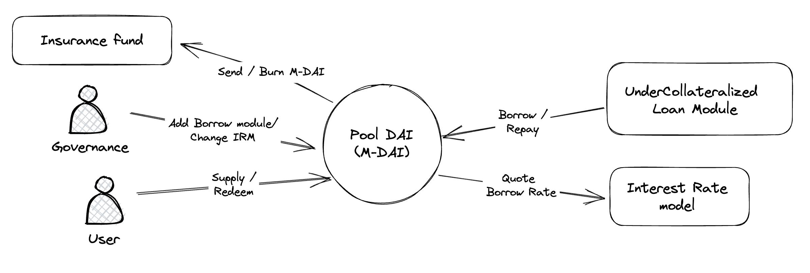
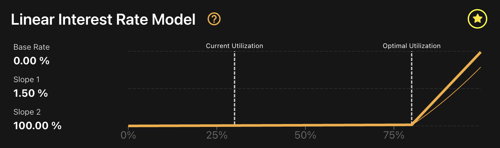

## Introduction

Lending pool protocols allow any crypto holder to lend their digital assets to other users. This means anyone can benefit from the opportunity to charge interest (that is, generate a passive rewards) as loans are repaid by those who borrow your crypto.

Users can deposit their assets into Morphine pools to provide liquidity for borrowers. By doing so, they can earn yields on their deposited assets.  Pools are tokenized and respect the ERC4626 standard so you could use it elsewhere in the DeFi space. Contracts are modular, different borrow module can be plugged (free to add flash loan or unused capital allocator modules in the future), and the interest rate model can be changed at any time.

## Interest Rate model

The protocol adjusts interest rates based on liquidity conditions. Low interest rates encourage borrowing when capital is abundant, while high interest rates incentivize debt repayment and additional capital supply when liquidity is scarce. Liquidity risk materialises when utilisation is high, and this becomes more problematic as the utilisation gets closer to 100%.

### Linear interest rate model

The linear interest rate curve is split in two parts around an optimal utilisation rate Uo. Before the slope is small, after it begins rising sharply.

An exemple from Dai Pool
[Dai Pool](https://app.morphine.store/Pools/0x7e758f80c7f650d595e1e0920b4455cb241737afc86982fa81776439dfdd0af)

1. Base Parameters:
   - Base Rate (R0): The minimum interest rate applied when utilization is low (e.g., 0%).
   - Optimal Utilization Rate (U_opt): The target utilization rate before the kink (e.g., 80%).
   - Slope 1 (S1): The slope of the linear interest rate model before the kink (e.g., 0.20).
   - Slope 2 (S2): The slope of the linear interest rate model after the kink (e.g., 1.00).

2. Utilization Rate (U):
   U = Total Borrows / (Total Borrows + Available Liquidity)

3. Interest Rate Model:
   - When U <= U_opt:
     Borrow Rate (R) = R0 + U * S1
   - When U > U_opt:
     Borrow Rate (R) = R0 + U_opt * S1 + (U - U_opt) * S2

Supply Rate (R_supply) = R_borrow * U * (1 - RF)

### PID Controller

Morphine's plan to transition from a linear interest rate model with a kink to a PID (Proportional-Integral-Derivative) controller rate model is driven by the desire to improve the platform's adaptability and responsiveness to market conditions. Here are some reasons behind this transition:

- **Enhanced adaptability**: A PID controller rate model can better adapt to fluctuations in market conditions, such as varying demand for borrowing and lending, by continuously adjusting the interest rates in real-time. This adaptability can lead to a more balanced and efficient market on the platform.

- **Improved stability**: By quickly reacting to changes in supply and demand, the PID controller rate model can help maintain the stability of the platform. It prevents sudden spikes or drops in interest rates that could otherwise disrupt the equilibrium between lenders and borrowers.

- **Optimized utilization**: The PID controller model can optimize the utilization of the lending pools, ensuring that interest rates are set at a level that encourages borrowing without depleting the liquidity pools entirely.

- **Greater precision**: The PID controller model offers more precise control over interest rates than a linear model with a kink. This increased precision can lead to better market efficiency and a more attractive platform for both lenders and borrowers.

Borrow rate =  U(t)*Scaling factor + E(t)*KP + Ki*sum(E(t)) + dE(t)/dt * Kd  
U(t) : Pool Utilization  
E(t) : Optimal Pool Utilization - Pool utilization  
Scaling Factor, KP, Ki, Kd and Optimal Pool Utilization are model parameters  

You can run this [script](https://colab.research.google.com/drive/1S_FAbyR_Qm0lfqI5OkVepY5wjlTo2l7p?usp=sharing) to simulate the PID.  
Some traders are "intelligent" and will borrow/repay regarding the borrow rate 
Some traders are "stupid" and they will borrow and repay in a random way. They represent the noise in the model.
After running simulations, we get utilization rate that are stable and high, ensuring a small gap between borrows and supplies.

