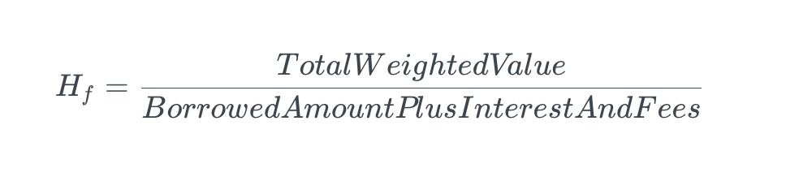
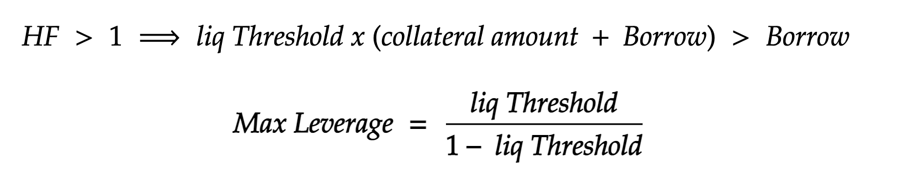

Morphine sub-accounts empower your DeFi experience with extraordinary capabilities. These smart contracts offer you the ability to get composable leverage throughout the DeFi ecosystem and the option to set up automations in a composable way, enabling a more seamless and efficient financial journey.

## Composable Leverage

 Morphine sub-accounts enable users to leverage their assets between 12x and 15x, granting them greater borrowing power. This feature allows borrowers to capitalize on opportunities in the DeFi market while managing their risk exposure.

### Weighted Collateral

 Morphine allows you to borrow assets from any available pools, providing various types of collateral (Tokens, LP, ERC4626, LSD). If your collateral can no longer cover your debt, you may face liquidation. To protect the pool from loss, user collateral is weighted for two reasons:

1. Liquidation involves fees, a premium for the liquidator, and another portion for the protocol. We need to account for these fees in the value of user collaterals.
2. The collateral can be different from the user's debt token. A highly volatile asset (against the debt token) could rapidly lose value, creating insolvency and a loss for the pool.

**Liquidation Threshold** = 1 - (liquidation premium + liquidation fees + asset volatility against the debt token)

You must ensure you have enough collateral to cover your loan; the health factor is a useful index to estimate your collateral ratio.

The total weighted value is the sum of each asset owned in the sub-account, multiplied by their liquidation threshold. The liquidation threshold is set by governance and accessible on the pool page. Interest fees are also determined by governance and can be found on the pool page.

### Buying Power

For example, if you deposit 100 DAI as collateral and the pool charges 2% liquidation fees and 1% liquidation premium, you can borrow up to 3233.3 DAI maximum (32x leverage). This is just an example as it uses the debt token as the collateral token. Keep in mind that it's usually counterproductive to get exposure in debt tokens and that other tokens typically have lower liquidation thresholds, leading in a lower leverage.

### Accumulated Debt 

Obtaining leverage has a standard cost for all borrowers, which is the borrow rate calculated by the integrated interest rate model (currently linear with a kink). However, to account for the increased risk to lenders when borrowers invest in riskier assets, borrowers using these assets will face a higher borrow rate. This boosted rate depends on a multiplier, which is determined by the governance (soon accessible on-chain) considering both the risk associated with the asset and the proportion of that risky asset in the borrower's portfolio. This innovative approach ensures that lenders are fairly compensated for the additional risk while maintaining an accessible and dynamic borrowing environment.

## Sub-account Management

### Manual

Sub-accounts on Morphine offer users the flexibility to manually manage their assets and interact with the DeFi ecosystem. Here are some ways users can manually intervene with their sub-accounts:

#### Add/Remove collateral

 Users can deposit or withdraw collateral to/from their sub-accounts. This allows them to adjust their collateral levels according to their risk preferences and changing market conditions.

#### Increase/Decrease debt
 Users can choose to borrow more or repay a portion of their debt, which gives them the ability to manage their leverage and maintain a healthy collateral ratio.

#### Interact with DeFi
 Sub-accounts enable users to directly interact with various DeFi protocols, such as swapping tokens, staking, or participating in liquidity pools. This empowers users to capitalize on DeFi opportunities and diversify their investment strategies, all within the Morphine platform.

Manual intervention provides users with control over their sub-accounts, allowing them to actively manage their assets and strategies in the DeFi space. Manage your sub_account from our frontend or directly using our SDK.

### Composable automations

You can set composable automated reallocation tasks for your sub-account management. Define condition and result, takers will be allowed to flash loan your sub_account and execute call to complete your task and for a prime.

**Rebalancing Condition:** Create or use a pre-built condition from our bank. The condition must contain a method `is_task_available` that returns a boolean. Inside, you can access various data to build logic, such as the health factor value (for liquidation protection) or the balances and prices of tokens in the sub-account (for take profit/stop loss or copy trading).

**Result Condition:** Create or use a pre-built condition from our bank. The condition must contain a method `is_condition_validated`, with the USD value of the sub-account before the taker multicall as argument, and returns a boolean. Inside, you can build logic while accessing the data of the sub-account that has been modified by takers. For example, you can check the new token allocation to ensure it meets specific criteria and use the previous multicall sub-account total USD value to define a prime for the borrower.

Once you've added your task with the rebalancing and result conditions, here's what will happen:

Numerous takers will be aware of the sub-account whose rebalancing condition is true. They will flash loan your sub-account for owner access and perform the necessary calls to meet the condition. The takers will then remove enough collateral from the account to their address to take the prime. Alternatively, they can send the assets that meet the desired allocation and remove those that are not wanted.

This composable approach allows you to define your own logic or use pre-built conditions from the Morphine Bank. The prime bonus should take into account the gas fees spent by users (thanks L2), accumulated loss through swaps, and the bonus for the taker.

