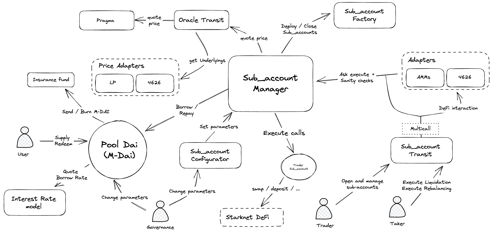

**Oracle Transit**  
Oracle Transit contract stores price feed source from allowed tokens and provides conversion functions between 2 Tokens

**PriceFeed Adapters**  
PriceFeed adapters contract provides pricefeed for special token like ERC4626 or LP and returns underling token(s).

**Pragma**  
Pragma Contract is the pricefeed provider.

**Sub_acounts Factory**  
Sub_accounts Factory contract deploys a sub_account contract if requested by the different borrow modules. Used sub_accounts are recycled to save gas.

**Sub_account**  
Container contract is the user account, storing collaterals, assets (in case of undercollateralized borrow) and borrow parameters. The container can perform calls if requested by the manager.

**Insurance Pool**  
Insurance Pool contracts receives all platform fees as pool tokens, and burn LP in case of loss to protect suppliers from eventual losses.

**Pool**  
Pool contract is an ERC4626 token providing rewards to the suppliers, paid by the borrowers.

**Interest Rate model**  
The interest rate model is calculated from an external contract, so it can be upgraded if needed. Currently, the linear interest rate model is used.

**Sub_account Transit**  
Sub_acount Transit contract is used by borrowers to create and manage their drip (add collateral, decrease debt, perform calls..). This contract also manages access and allowances and provides utils functions for takers.

**Sub_account Configurator**  
Sub_account Configurator contract can only be used by the admin, to manage allowed tokens, allowed integrations, borrow and liquidation parameters.

**Sub_account Manager**  
Sub_account Manager contract contains all the logic to create, manage, close or liquidate a Sub_account. Sub_account manager is used by drip configurator to set parameters and by drip transit to execute actions on drip if allowed.

**Adapters**  
Adapters contracts are smart contracts that act as intermediaries or connectors to facilitate interactions between different protocols. They are designed to standardize and simplify the process of integrating with other protocols by abstracting the complexity of interacting with different interfaces or implementations.
