## First Steps

1. Install a compatible Starknet Wallet:  
[Braavos](https://chrome.google.com/webstore/detail/argent-x/dlcobpjiigpikoobohmabehhmhfoodbb)
[Argent X](https://chrome.google.com/webstore/detail/braavos-smart-wallet/jnlgamecbpmbajjfhmmmlhejkemejdma)

2. Add Starknet Goerli 2 network

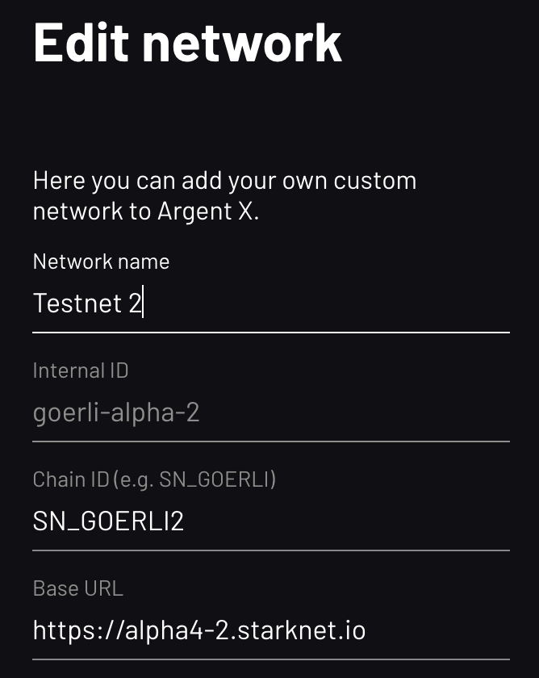

3. Get ETH Goerli 2  
   - faucet: no faucet  
   - Ask in the Discord

4. Mint Faucet Tokens  
   - head to [Morphine](https://app.morphine.store/)  
   - Make sure you are connected to goerli 2 and connect wallet  
   - Once connected, click on Faucet button in the toolbar  
   - Either you mint those you want either you can directly mint all of them

5. Mint Pass  
   - If you are interested in testing the borrow feature, you need to mint a pass, only available if you are whitelisted. Come talk in the Discord and we'll probably give you one!  
   - Once transactions are confirmed, head to your portofolio and you should see tokens

   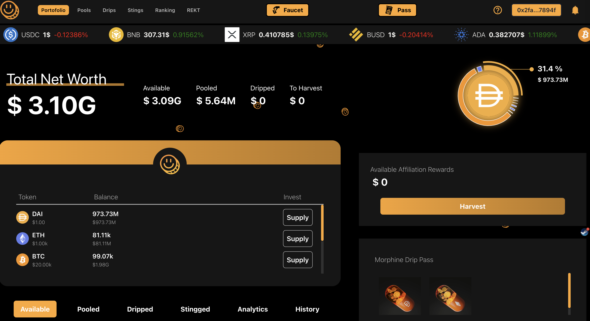

6. The portofolio page gather all the information about you:  
   - Tokens  
   - Pool tokens  
   - Sub_account holdings  
   - Stings collateral  
   - Analytics (PNL, performances)  
   - History (to keep a track of your actions)  
   - Your affiliation rewards, if you are taking avantage of referrals or managing strategies that are used by other users.  
   - Your Pass to access borrowing module

## Pool

**Click on Pool in the navbar, you'll see the list of pools deployed.**

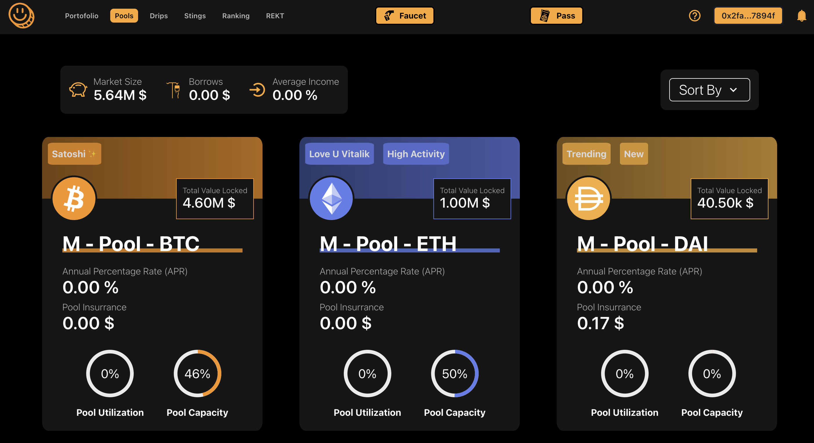

**Click on the pool you want to supply assets**

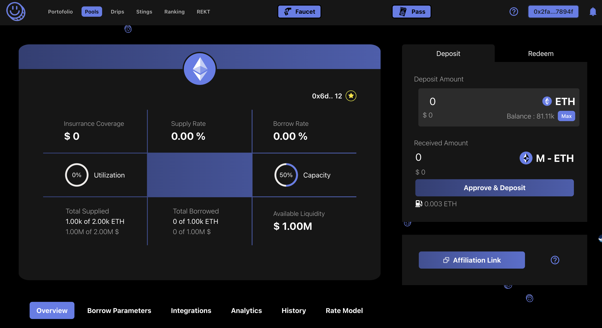

The left side gather information of the pools. You can find:

- Global Information concerning pool
- Global information regarding borrow module
- Integrated protocols and tokens
- Analytics to see how is the pool performing
- Pool history
- Interest model current parameters and last updates (as it is usually updated)

The right side allow you to:

- Supply Asset in the pool (select an amount and get erc4626 pool token)
- Redeem ERC4626 pool tokens in the same way

## Deploy Sub_account

**Head to Drips (from the navbar) and select on of asset you want to borrow**

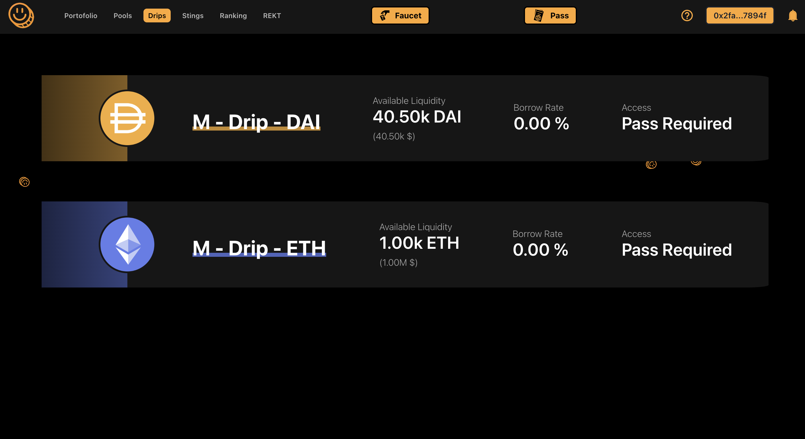

**Now, add some collaterals and move the slider to increase your borrow **

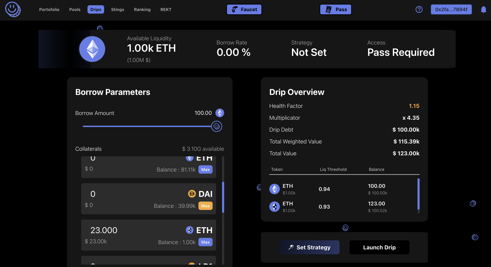

You can select a final exposure in "Set Strategy"
Your collateral and borrow assets will be converted into the strategy token allocation. 

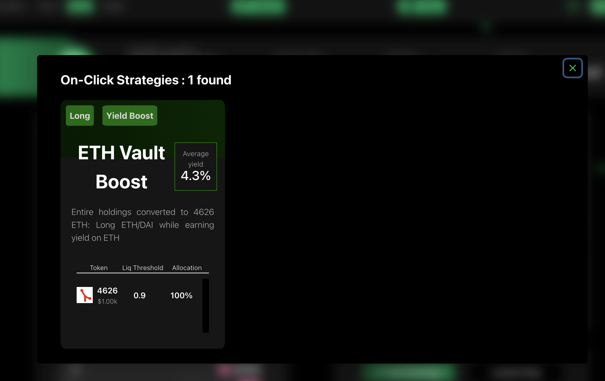

(Yagi Vault is a 4626 Mock strategy)

When you are all ready, you can deploy your sub_account. Make sure of the following or you'll get an error message:
- Enough liquidity in the pool
- If the passe is required, make sure to have one
- Health factor bigger than one

**Once created, you should arrive on the Sub-account Management Page**

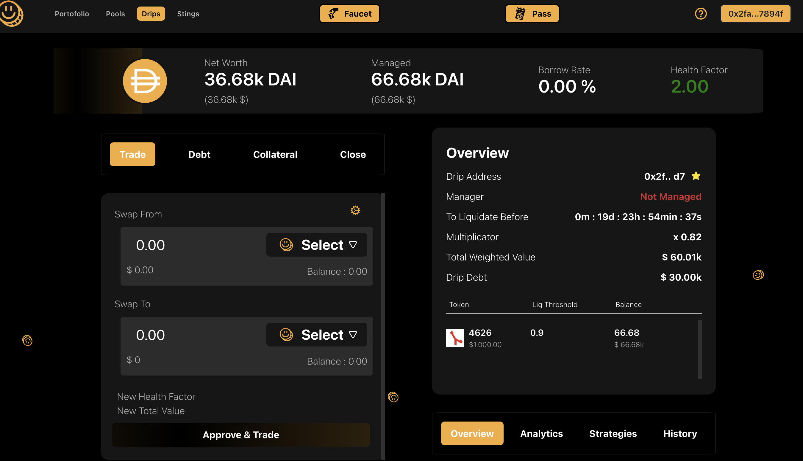

## Multi Swap tokens

**Start by selecting slippage, tokens to swap (can be many at once) and incomig asset**

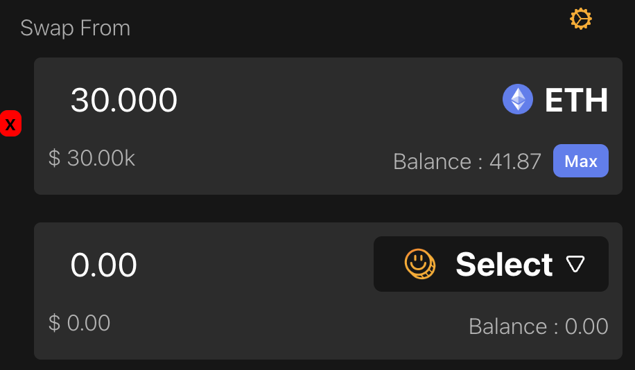

**Once From and To tokens are selected, you'll see the new health factor and money lost/won**

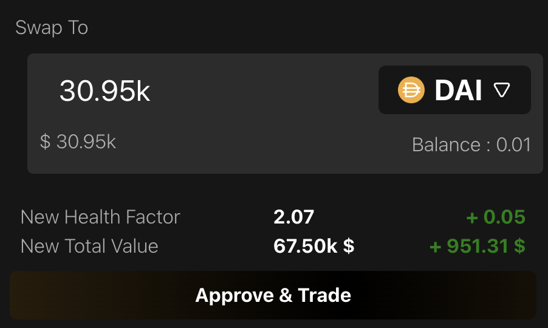

** Once All ready, Approve & Trade.**

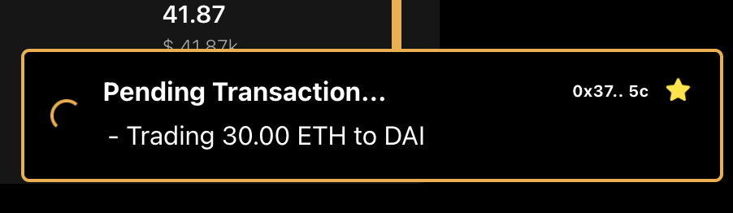

## Manage Debt

**Move the slider and click on approve & adjust debt once you choose your new debt.**

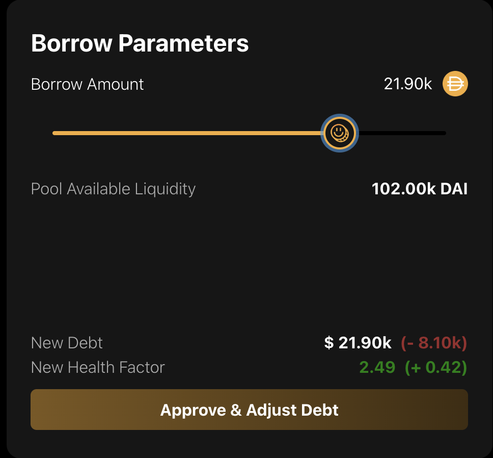

## Add collaterals

**Type desired token amount to provide collateral.**

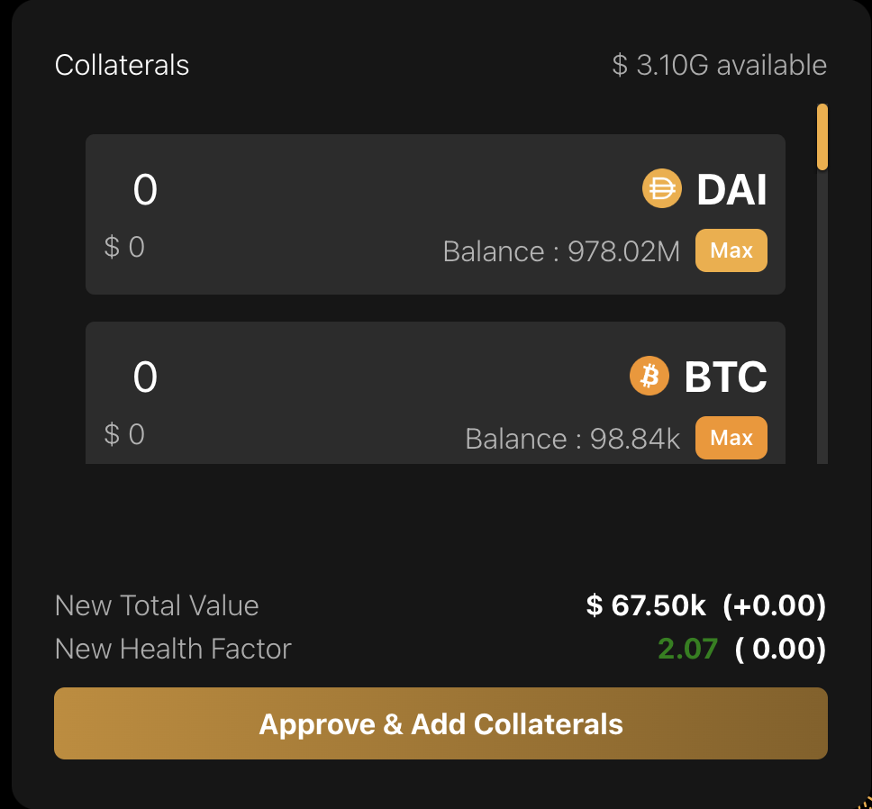

## Close Sub_account

**If you have enough debt tokens, close your sub_account and all the tokens will be transfered to your account. You'll soon be able to Add collateral or perform trade before closing the account in case you don't have enough debt token.**

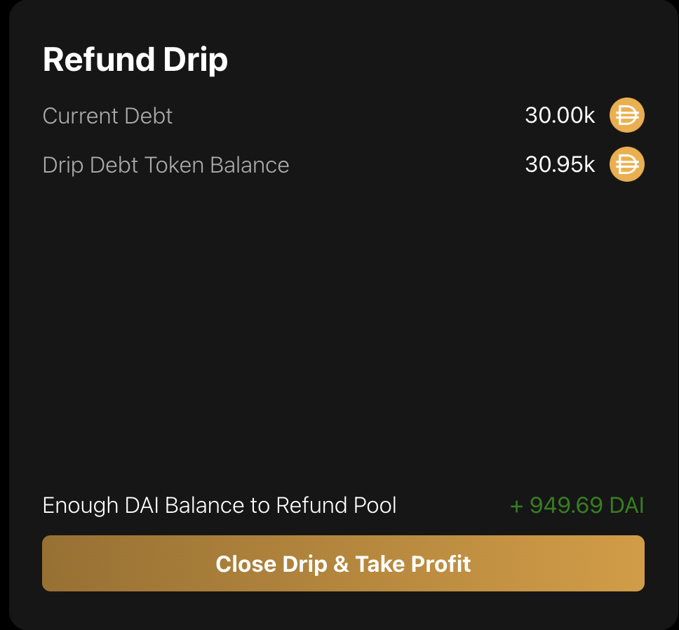